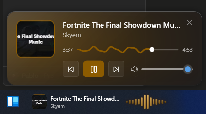
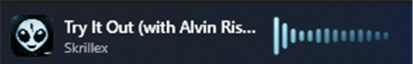

<h1 align="center">🎵 FluentTune</h1>

<p align="center">
  A modern, Fluent-design music widget for the Windows 11 taskbar.<br>
  See and control whatever is playing on your PC — Spotify, YouTube, any app — with a glassy
  flyout, a live audio spectrum on the taskbar, and colors that adapt to the album art.
</p>

<p align="center">
  
</p>

<p align="center">
  <a href="https://github.com/psanchezp2/FluentTune/releases/latest/download/FluentTune.zip">
    
  </a>
</p>

<p align="center">
  <b><a href="https://github.com/psanchezp2/FluentTune/releases/latest/download/FluentTune.zip">⬇ Download the app</a></b> — free &amp; self-contained (no .NET install needed) · Windows 10/11 64-bit
</p>

<p align="center">
  
  
  
</p>

---

## ✨ Features

- **Now-playing flyout** — album art, title/artist, transport controls (previous / play-pause / next) and system volume, in a translucent *liquid-glass* card.
- **Album-color adaptation** — the whole UI (glow, accent, controls, spectrum) recolors to match the current song's cover.
- **Taskbar audio spectrum** — a live, glowing spectrum visualizer sits on the left of the taskbar next to a mini now-playing. It reacts to the audio and eases down smoothly when you pause.
- **Ocean-wave progress bar** — an Android-style wavy seek bar that pulses with the music. Drag to seek.
- **Click to open** — click the taskbar widget to toggle the flyout.
- **System-tray resident** — show, *start with Windows*, and quit from the tray menu.
- **Works with any player** — reads the Windows media session (GSMTC), so it controls Spotify, browsers, and more.

## 📷 Screenshots

<table>
  <tr>
    <td align="center">
      <br>
      <sub>Live, compact taskbar spectrum + mini player</sub>
    </td>
    <td align="center">
      <br>
      <sub>Ocean-wave progress bar (drag to seek)</sub>
    </td>
  </tr>
</table>

> The whole UI recolors to match the current album's cover.

## 🚀 Getting started

### Download & run
1. **[⬇ Download FluentTune.zip](https://github.com/psanchezp2/FluentTune/releases/latest/download/FluentTune.zip)** (or from the [Releases](../../releases) page).
2. Unzip and run **`FluentTune.exe`** — it's a self-contained build, so **no .NET install is required**.
3. A ♪ icon appears in the system tray. Play some music and a mini widget shows up on the left of the taskbar — click it to open the player.

Requires **Windows 10/11 (64-bit)**.

### Build from source
```bash
git clone https://github.com/psanchezp2/FluentTune.git
cd FluentTune
dotnet build -c Debug
dotnet run
```
Requires the **.NET 8 SDK** (with the Windows Desktop workload).

To produce the self-contained single-file executable:
```bash
dotnet publish -c Release -r win-x64 --self-contained true -p:PublishSingleFile=true -p:IncludeNativeLibrariesForSelfExtract=true
```

## 🛠️ Tech stack

| Area | Library |
|------|---------|
| Framework | .NET 8 **WPF** |
| Fluent UI | [WPF-UI](https://github.com/lepoco/wpfui) |
| Media read/control | Windows **GSMTC** (`GlobalSystemMediaTransportControlsSessionManager`) |
| Audio spectrum + volume | [NAudio](https://github.com/naudio/NAudio) (WASAPI loopback + Core Audio) |
| MVVM | CommunityToolkit.Mvvm |

## 📁 Project layout

```
FluentTune/
├── Controls/            WaveProgressBar (custom ocean-wave seek bar)
├── Services/            MediaService, VolumeService, AudioSpectrumService, ColorExtractor, StartupService
├── ViewModels/          NowPlayingViewModel
├── Converters/          PlayPauseSymbolConverter
├── MainWindow.xaml      The glass flyout
├── SpectrumWindow.xaml  The taskbar overlay (mini now-playing + spectrum)
└── App.xaml             Entry point
```

## 📝 License

Released under the [MIT License](LICENSE).

<sub>Built from scratch as an original take on the taskbar-music-widget idea.</sub>
